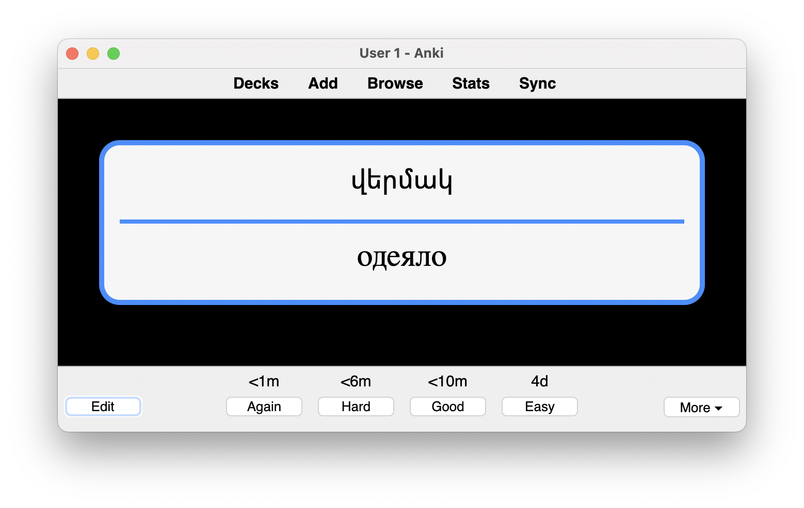

# am-ru-anki

This script uses [mnemocards](https://github.com/guiferviz/mnemocards) generator in order to generate Anki package files with Armenian words from Russian words listed in [words.txt](data/words.txt).

An SQLite dictionary is used. However, it may contain errors, missing or extra words, file an issue if you see a mistake or know a better Russian-Armenian dictionary that can be accessed or parsed freely.

Most words in the default words.txt file are double-checked manually.

How it looks:


## Usage

1. You can download the ready deck with ~300 words, since it's an artifact of GitHub Actions workslow https://github.com/CommanderTvis/am-ru-anki/actions.
2. Or add more words in PR changing [words.txt](data/words.txt).
3. Or add your words locally, then build manually with
```python
pip install -r requirements.txt
python3 ./main.py generate -f cards_config.json ./data
```
